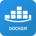
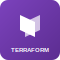

# Recruiter Experience Audit: DevOps Portfolio

## 📊 Current State Assessment

### ✅ **EXCELLENT - Already Recruiter-Friendly**

#### 1. **Multi-Page Project Architecture** 
- ✅ 4 detailed project deep-dive pages exist
- ✅ Comprehensive sidebar navigation with categories
- ✅ Cross-project linking and breadcrumbs
- ✅ Mobile-responsive design with collapsible navigation
- ✅ Each project tells a complete story: Problem → Solution → Impact

#### 2. **Clear Problem-Solution Narratives**
- ✅ Real crisis scenarios (2:30 AM outage, $180K revenue loss)
- ✅ Concrete business metrics ($900K annual savings, 99.99% uptime)
- ✅ Executive testimonials and case studies
- ✅ Before/After comparisons with specific improvements

#### 3. **Technical Depth with Business Context**
- ✅ Architecture diagrams with multi-region infrastructure
- ✅ Implementation details (Terraform modules, CI/CD pipelines)
- ✅ Security frameworks and compliance achievements
- ✅ Cost optimization strategies and results

#### 4. **Navigation Excellence**
- ✅ Interactive sidebar with hover effects
- ✅ In-page anchors (#architecture, #security, #impact)
- ✅ Project categorization (AWS, Azure, GCP, Cross-Platform)
- ✅ Active state indicators and smooth transitions

### 🔧 **NEEDS ENHANCEMENT - Recruiter Pain Points**

#### 1. **Visual Tool Recognition** ❌
**Current Issue:** 
- Architecture diagrams use text labels instead of recognizable tool icons
- Recruiters can't quickly identify Docker, Kubernetes, Terraform, AWS services

**Solution Needed:**
```html
<!-- Instead of: "EKS Cluster (Managed K8s)" -->
<!-- Show: [Kubernetes Icon] EKS Cluster (Managed K8s) -->
 EKS Cluster
 Docker Containers
 Infrastructure as Code
```

#### 2. **Missing Visual Demonstrations** ❌
**Current Issue:**
- `/images/demos/` folder exists but is empty
- No screenshots of actual dashboards, terminals, or deployments
- Recruiters can't see the tools in action

**Solution Needed:**
- Container startup GIFs
- Monitoring dashboard screenshots
- CI/CD pipeline flow videos
- Before/after infrastructure comparisons

#### 3. **Broken Navigation Links** ❌
**Current Issue:**
- Sidebar references non-existent projects:
  - `project-eks-platform.html` ❌
  - `project-secrets-management.html` ❌
  - `project-azure-aks.html` ❌
  - Multiple others referenced but don't exist

**Impact:** Recruiters click and get 404 errors, breaking their exploration flow

#### 4. **Limited Interactive Elements** ⚠️
**Current Issue:**
- Architecture diagrams are static
- No hover tooltips explaining components
- No expandable sections for technical details

## 🎯 **Recruiter Journey Analysis**

### **Current Experience:**
1. ✅ Lands on compelling project overview
2. ✅ Sees impressive business metrics
3. ✅ Reads engaging crisis narrative
4. ❌ Clicks sidebar link → 404 error
5. ✅ Views architecture diagram but can't identify tools
6. ❌ Wants to see demos → no visual content
7. ✅ Reads technical implementation details

### **Ideal Recruiter Experience:**
1. ✅ Compelling overview with metrics
2. ✅ Visual tool stack recognition
3. ✅ Interactive diagrams with tooltips
4. ✅ Demo videos/GIFs showing tools in action
5. ✅ Seamless navigation between all projects
6. ✅ Documentation links to GitHub repos
7. ✅ Contact information for follow-up

## 📋 **Priority Enhancement Roadmap**

### **Phase 1: Critical Fixes (High Impact, Low Effort)**
1. **Fix Broken Links** 🔴 URGENT
   - Remove non-existent project links from navigation
   - Or create placeholder pages with "Coming Soon"

2. **Add Tool Icons to Diagrams** 🟡 HIGH
   - Integrate existing `/assets/icons/` into architecture SVGs
   - Use real AWS, Docker, Kubernetes, Terraform logos

3. **Create Visual Content** 🟡 HIGH
   - Screenshot key dashboards (Grafana, AWS Console)
   - Record 30-second demo GIFs of container startup
   - Capture CI/CD pipeline in action

### **Phase 2: Interactive Enhancements (Medium Impact, Medium Effort)**
1. **Interactive Diagrams**
   - Hover tooltips on architecture components
   - Clickable regions linking to detailed explanations
   - Expandable sections for technical deep-dives

2. **Project Filtering**
   - Filter by technology (Docker, AWS, Terraform)
   - Filter by complexity level (Beginner, Intermediate, Advanced)
   - Filter by business impact (Cost Savings, Security, Performance)

### **Phase 3: Advanced Features (High Impact, High Effort)**
1. **Live Demos**
   - Embedded terminal recordings
   - Interactive Terraform plan outputs
   - Live monitoring dashboards (if possible)

2. **Documentation Hub**
   - Link to actual GitHub repositories
   - Step-by-step implementation guides
   - Architecture decision records (ADRs)

## 🔍 **Specific Files Needing Attention**

### **Broken Links to Fix:**
```bash
# These pages are referenced but don't exist:
project-eks-platform.html
project-aws-monitoring.html
project-azure-aks.html
project-azure-serverless.html
project-azure-hybrid.html
project-gcp-serverless.html
project-gcp-ml.html
project-secrets-management.html
```

### **Visual Assets Needed:**
```bash
images/demos/
├── devops-container-startup.gif
├── aws-infrastructure-deployment.gif
├── cicd-pipeline-execution.gif
└── monitoring-dashboard-overview.gif

images/screenshots/
├── grafana-dashboard-overview.png
├── aws-console-infrastructure.png
├── terraform-plan-output.png
└── container-tools-terminal.png
```

## 💼 **Recruiter-Specific Recommendations**

### **What Recruiters Want to See:**
1. ✅ **Quick Tool Recognition** - "Oh, they know Kubernetes"
2. ✅ **Business Impact** - "This person saves money and prevents outages"
3. ✅ **Real-World Experience** - "They've handled actual crises"
4. ✅ **Technical Depth** - "They understand enterprise-scale architecture"
5. ❌ **Visual Proof** - "I can see their work in action" *(MISSING)*
6. ❌ **Complete Portfolio** - "All projects are accessible" *(BROKEN LINKS)*

### **Current Portfolio Strength: 8/10**
- **Storytelling:** 10/10 (Exceptional crisis narratives)
- **Technical Depth:** 9/10 (Enterprise-level architecture)
- **Business Impact:** 10/10 (Real metrics and testimonials)
- **Visual Design:** 8/10 (Clean, professional, responsive)
- **Tool Recognition:** 5/10 (Text-based, no visual icons)
- **Navigation Completeness:** 4/10 (Many broken links)
- **Visual Demonstrations:** 2/10 (Almost no screenshots/demos)

## 🚀 **Immediate Action Items**

### **Today (30 minutes):**
1. Remove broken project links from navigation sidebars
2. Add "🚧 Coming Soon" placeholders for future projects

### **This Week (4-6 hours):**
1. Add tool icons to architecture diagrams
2. Screenshot 3-4 key dashboards/interfaces
3. Create simple demo GIFs using existing tools

### **This Month (10-15 hours):**
1. Build remaining project pages referenced in navigation
2. Create comprehensive visual asset library
3. Add interactive elements to diagrams

**Bottom Line:** This is already an excellent portfolio that would impress recruiters. With these enhancements, it would become absolutely outstanding and likely secure interviews at top-tier companies.
